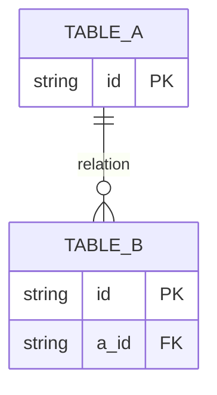

# {{Feature name}} plan

## Context

- What exists today.
- Relevant architecture, dependencies, or constraints.
- Link to related plans or prior work.

## Goal

One sentence describing the outcome. Then a short paragraph if needed.

## What

A precise definition of the feature. What is in scope and what shape does it take?

## Why

Why build this now? What user pain or product opportunity does it address?

## How

### Conceptual model

Explain the core abstraction. Use a diagram if it helps.

### Operations / behavior

List the main actions the feature supports.

### Tech choices

| Choice | Decision | Rationale |
|--------|----------|-----------|
| Library A vs B | A | Why |

### Architecture

```
ASCII or mermaid diagram showing flow.
```

## What this allows

- Capability 1.
- Capability 2.

## What this does not allow

- Out-of-scope capability 1.
- Deliberate limitation 2.

## UI & UX

### Desktop

ASCII mockup or description.

### Mobile

ASCII mockup or description.

### Common interactions

| Action | Result |
|--------|--------|
| Click X | Y happens |

## Data model



## Implementation steps

1. Step one.
2. Step two.
3. Step three.

## Open questions

1. Question one?
2. Question two?

## Acceptance criteria

- [ ] Criterion 1.
- [ ] Criterion 2.

## Decisions log

| Date | Decision | Rationale |
|------|----------|-----------|
| YYYY-MM-DD | Chose X over Y | Reason |
