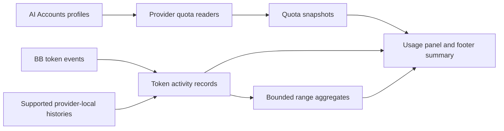
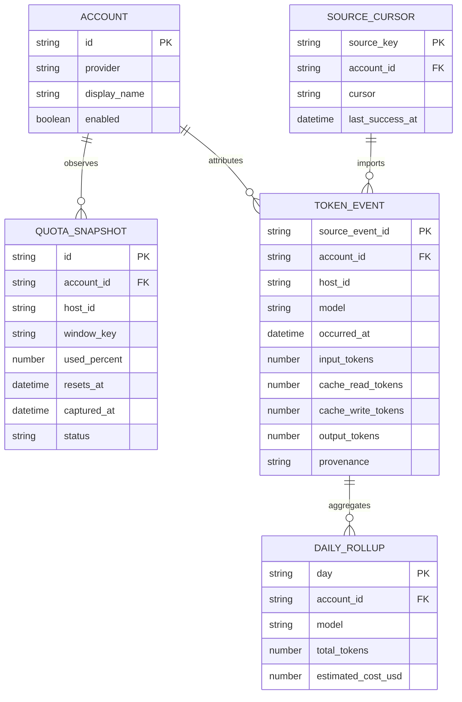

# AI Accounts usage plan

## Context

- The AI Accounts plugin currently manages separate Codex and OpenCode Go profiles, registers each enabled profile as a BB provider, and reads live subscription windows through its provider bridge.
- Codex limits come from `account/rateLimits/read`; OpenCode Go limits come from `/zen/go/v1/usage`. The plugin already has normalized `usedPercent`, reset time, plan, identity, and per-account provider information.
- The page is already a plugin `navPanel`. BB's SDK also has an additive `experimental_sidebarFooter` API that supports an icon button and a plugin-rendered disclosure above the sidebar footer. BB Appearance settings expose a user-controlled **Show Provider usage in footer** toggle.
- The SDK has `thread/tokenUsage/updated` events and a system usage-limits query. The existing plugin documentation says BB's native token and cost history is limited to sessions started in BB and has no plugin history import surface; historical access and event ownership need a focused SDK/runtime spike.
- BB's built-in Usage page is host-owned. The plugin SDK has no contribution slot for its contents. The supported plugin route is a separate panel. The native Provider Usage footer shortcut can be hidden by the user in **Settings → Appearance → Sidebar footer → Show Provider usage in footer**; the plugin does not change that preference.
- Tokitoki is design inspiration only. This plugin will own its collectors, schemas, local persistence, queries, and UI; it will not invoke Tokitoki, read its database or event files, or depend on its installation.

## Goal

Give every configured AI Accounts profile an accurate, history-aware view of subscription headroom and token activity in BB, with explicit freshness and data-quality signals.

Show live remaining quota beside reset times, preserve snapshots so quota movement can be charted, and show token volume and breakdowns from independently collected account activity. Keep quota percentages separate per account and window: these limits have different denominators and must not be averaged into a misleading global percentage.

## What

- Add a dedicated **Usage** page inside AI Accounts, alongside the existing account-management page.
- Show all enabled accounts, grouped by provider and profile, with every reported usage window, remaining percent, reset countdown/time, plan label, last successful refresh, and stale/error/unauthenticated state.
- Record quota snapshots over time and chart the remaining/used percentage within each reset cycle. Show gaps and reset boundaries instead of connecting unrelated cycles as if they were continuous.
- Show token totals and daily trends, split by provider, account, model, and (where available) BB thread or project. Separate input, cached input, cache writes, output, and reasoning only when the source reports those values.
- Provide useful ranges (24 hours, 7, 30, and 90 days), account/provider filters, refresh, and per-account/window detail.
- Add a compact footer disclosure showing the most constrained current windows across configured accounts, with freshness and a click-through to the Usage panel.
- Prefer independently collected local provider activity for accounts managed by this plugin. Include BB session events and provider-native local histories only where the source format is supported and can be attributed to a configured account. Label exact reported counts separately from estimates or unavailable sources.
- Defer cost estimates until a versioned price source and cache-token pricing can be represented reliably; never describe estimated API-equivalent cost as the user's actual subscription bill or quota consumption.

## Why

BB's current account quota view does not provide the desired cross-account token history, trends, or breakdowns. The native Usage page cannot currently receive plugin account data through a documented extension point. A plugin-owned dashboard can show every configured account together while making provider limits and token telemetry comparable without pretending they share one quota.

## How

### Conceptual model

Keep live quota observations, durable history, and derived summaries distinct:



- **Quota observation:** one account, host, provider window, observation time, used percentage, reset time, provider status, and source.
- **Token activity:** one deduplicated usage event, account/provider identity, timestamp, model, token categories, provenance, and whether values are provider-reported or estimated.
- **Derived aggregate:** a bounded query over token activity. Raw observations/events remain the source of truth for chart and breakdown queries; this release does not persist daily rollup rows.
- A quota snapshot is not a token event. A decrease in remaining percentage may come from BB, another client, or provider-side accounting, so do not infer exact token counts from it.

### Operations / behavior

- On plugin startup and the configured polling interval, collect supported quota windows for each enabled profile and applicable host/path override. Also refresh on explicit user request and when a fresh provider usage response is already available.
- Store successful snapshots; store bounded failure/status observations only as needed to communicate freshness and recovery. Never store credentials or raw provider responses.
- Compute `remainingPercent = 100 - usedPercent` from the validated provider value. Retain its original precision internally; round only for display. Treat absent windows, expired/reset windows, stale data, unauthenticated profiles, and request failures as distinct states.
- Use an idempotency key from the source event identity. Treat cumulative thread token updates as cumulative state and persist deltas or replaceable per-turn totals, never add repeated cumulative values.
- Import supported provider-local histories incrementally with per-source cursors and bounded scans. Begin from the latest available source position; do not imply complete history before the first successful import.
- Refresh views without blocking page navigation. Preserve the last successful snapshot when a refresh fails and mark its age visibly.
- If provider-native history is unsupported or attribution to an account is ambiguous, omit that source and say why rather than assigning it to a guessed profile.

### Tech choices

| Choice | Decision | Rationale |
|--------|----------|-----------|
| Page placement | BB plugin `navPanel` with a Usage sub-route/tab | Supported plugin-owned page surface; keeps account setup in the same plugin. |
| Footer | `experimental_sidebarFooter` disclosure with a compact summary | Supported additive surface; can show a native-feeling overview without replacing other footer controls. |
| Native Usage page | Do not patch or inject content into the host page | There is no documented Usage-page contribution slot; DOM interception would be brittle and unsupported. Record an upstream extension-point request as an optional follow-up. |
| Native Provider Usage button | Keep the host preference user-controlled | Verified in BB Appearance settings: **Show Provider usage in footer** hides or shows the native shortcut. The plugin does not mutate this preference. |
| Persistence | Plugin-owned SQLite tables (or the current SDK-supported durable DB), with indexed bounded queries and versioned migrations | History must survive plugin reloads and server restarts without depending on Tokitoki or large KV blobs. Confirm the runtime storage API in the spike. |
| Quota source | Reuse the plugin's typed Codex/OpenCode Go readers and the provider usage contract; collect once per account/host with deduplication | Avoid divergent percent/reset parsing and duplicate provider requests. |
| Token source | BB lifecycle/token usage events plus independently implemented, source-specific readers for supported account-local history | Preserves history outside BB when available while remaining standalone. Do not assume every source has exact token counts. |
| Charts | Small plugin-owned SVG/HTML chart components using existing app styling | Avoid a new chart dependency until interaction/accessibility needs are established. |
| Cost | Defer estimates from this release | No versioned pricing table is included; provider subscription limits and token totals are available without presenting speculative spend. |

### Architecture

```text
AI Accounts server/plugin storage
  profiles + host/path resolution
  quota collection / bounded polling
  local token-source ingestion and cursors
  schema-versioned SQLite history + aggregate queries
            │ validated RPC
            ▼
AI Accounts app
  Usage nav panel: limits, trends, breakdowns, source coverage
  sidebar footer disclosure: constrained windows + freshness
```

The first implementation step is a feasibility spike against the installed BB version: verify background scheduling and host-scoped quota reads, token event payloads and account identity, durable DB support, and historical session access. If a capability is absent, keep the data contract honest and use the supported local provider source or mark that history unavailable; do not add a host DOM hack.

## What this allows

- Compare remaining quota across all enabled AI Accounts profiles without collapsing unrelated provider limits.
- See quota usage evolve over time and identify whether an account is trending toward exhaustion within its current reset window.
- Compare token activity across accounts, providers, models, and supported projects/threads.
- See which sources contributed data and whether a displayed count is exact, estimated, incomplete, or stale.
- Reach the full usage dashboard from the plugin panel and glance at critical account windows from the sidebar footer.

## What this does not allow

- Edit or replace BB's built-in Usage page contents through an unsupported injection.
- Promise exact token history for sources that do not expose token counts, or attribute activity when the configured account cannot be identified.
- Infer token counts or actual billing cost from quota percentages.
- Merge account quotas into a single remaining percentage, or imply that profiles on different plans share one pool.
- Send usage history to Tokitoki, another service, or a remote analytics backend.
- Add notifications or automatic account switching in this feature; those require separate supported host behavior and explicit design.

## UI & UX

### Desktop

Usage panel top controls: `Tokens | Limits`, range (`24h | 7d | 30d | 90d`), account/provider/machine filters, refresh, and last-updated status.

```text
Usage  /  All accounts                         30 days   ↻

LIMITS
Codex · Alex                                      updated 2m ago
Session   86% left  ━━━━━━━━━━━━━━━━━━━░░   resets in 58m
Weekly    52% left  ━━━━━━━━━░░░░░░░░░░░   resets in 2d 10h

OpenCode Go · Work                              updated 4m ago
Rolling   64% left  ━━━━━━━━━━━━━░░░░░░░   resets in 41m
Weekly    91% left  ━━━━━━━━━━━━━━━━━━░░   resets in 5d

TOKENS · 7 DAYS                  DAILY TOKENS BY ACCOUNT
Input  1.2M · Output 420k        [stacked trend chart]
Cached input 800k · Writes 3k    [Codex Alex] [OpenCode Work]

BREAKDOWN   Provider | Account | Model | Project | Day
```

The footer disclosure shows the two most constrained windows, reset countdowns, source freshness, a refresh action, and an **Open Usage** action. It must identify the account beside every percentage.

### Mobile

The same information collapses into a single-column panel. Keep account identity and window label adjacent to the percentage; charts may scroll horizontally. Verify whether the current BB mobile surface mounts plugin panels and footer disclosures before treating mobile as a launch requirement.

### Common interactions

| Action | Result |
|--------|--------|
| Open Usage | Show current limit windows and selected token range for all enabled accounts. |
| Select an account/provider | Filter charts and breakdowns; leave account identity visible. |
| Change range | Query the same persisted event/snapshot history at the selected range. |
| Refresh | Request supported current quota values; keep prior successful values and show a stale/error state if refresh fails. |
| Open a quota window | Show provider-reported used/remaining percent, reset time, last observations, and gaps within this reset cycle. |
| Open a quota chart point | Show remaining-percent change, snapshot interval, and recorded tokens by model for that account/window. Model activity is context only; providers do not attribute quota changes to models. |
| Open a token chart point | Show date, token categories, account/model, source, and estimate status when applicable. |
| Open the footer disclosure | Show compact constrained windows; **Open Usage** navigates to the full plugin panel. |

## Data model



The production schema may use composite keys for daily rollups and quota windows. Persist only identifiers and usage facts needed for display; never persist auth files, API keys, transcript bodies, prompts, or raw provider payloads. Store quota percentages with the source window duration/label and reset timestamp so equal-duration windows do not collide.

## Implementation steps

1. **SDK feasibility and source inventory:** confirm installed BB APIs for persistent database, background polling, per-host provider usage, event payloads, account attribution, and historical sessions; inventory supported Codex/OpenCode Go local token-history formats and their exactness. Verify native footer visibility settings and whether the built-in Usage footer action can be hidden without hiding unrelated controls. **Complete:** the Appearance toggle is user-controlled; the built-in Usage page has no documented plugin contribution slot.
2. **Usage contracts and storage:** define validated quota snapshot, token event, status, source provenance, and coverage schemas; add versioned plugin-owned persistence, indexes, retention, deduplication, and bounded range queries.
3. **Quota collection:** reuse existing readers, correctly resolve profile path overrides per host, collect enabled profiles, persist snapshots, and expose current values plus history through bounded RPC queries.
4. **Token ingestion:** ingest BB token events idempotently; add incremental Codex/OpenCode Go local-history adapters only for proven formats and account mapping. Preserve source cursors and exact/estimated/unsupported coverage.
5. **Usage panel:** implement compact sidebar-matched account cards, reset-cycle timelines, token totals/trends, filters, model/provider/account breakdowns, stale/error/empty states. In Compare, show banked resets beside each account's first quota bar and list the largest remaining-quota drops with the account, window, timestamp interval, and recorded model token activity. Keep model activity explicitly contextual because providers do not attribute quota changes to models. **Cost estimate deferred** pending a reliable versioned pricing source.
6. **Footer glance:** register a disclosure with the most constrained account windows, freshness, refresh, and a route to the full Usage panel.
7. **Documentation and acceptance proof:** document source coverage and privacy boundaries; validate rate-window math, reset boundaries, duplicate events, restarts, failed polls, unavailable source data, multiple profiles, and the complete page/footer flow in the running BB app. Automated checks/build pass. Live page/footer verification remains pending integration into the installed plugin checkout, which is a separate active checkout with newer account UI changes.

## Open questions

Resolved for this release: bounded Codex and OpenCode Go local histories are included on the primary machine when tied to configured profile paths; quota snapshots are retained 90 days and token events one year; native Provider usage visibility remains the user's Appearance preference; cost estimates are deferred. Local formats are treated as partial/unavailable when parsing or attribution is uncertain.

## Acceptance criteria

- [x] The Usage panel includes enabled configured accounts and every usage window returned by providers; disabled accounts are excluded.
- [x] Remaining percent is computed as `100 - provider usedPercent`, with automated checks for 0%, 100%, invalid, absent, and reset-window values.
- [x] Limits are grouped by provider and account, with account cards and a comparison-bar layout; each window displays remaining/used percent, reset countdown, observation time, and provider freshness/error state.
- [x] The active quota overview keeps the latest snapshot per account, host, and provider window even as reset timestamps move; the stored history remains intact, is bucket-deduplicated, and sparklines separate reset cycles and preserve gaps.
- [x] Quota trend charts start at their first recorded observation, expose banked reset expiries, and show model-token activity for each snapshot interval without claiming provider-confirmed causation. A single used host is omitted from account labels.
- [x] Codex banked reset counts and earliest expiry are collected server-side when locally configured credentials and the provider reset-credit endpoint are available; failures leave this optional detail unavailable without breaking quota refresh.
- [x] Token charts and totals use deduplicated usage facts, preserve reported token categories, and label incomplete or unavailable sources. Estimates are not included in this release.
- [x] Repeated cumulative usage updates and duplicate local-history scans are idempotent; durable SQLite history and cursors survive plugin reloads/restarts by design.
- [x] Provider-local ingestion reads configured account paths, stores no credentials or transcript content, and does not depend on Tokitoki.
- [x] No estimates are displayed; provider token counts remain separate from subscription quota and billed cost.
- [x] Verify the footer disclosure's account/window percentages, compact-width behavior, and Usage navigation in the installed plugin runtime.
- [x] The built-in BB Usage page remains host-owned. The supported Appearance preference for its Provider Usage footer shortcut was verified and documented as a user choice.
- [x] Focused automated checks and plugin build pass.
- [x] Live interaction verifies the page, panel navigation, and footer disclosure in the installed plugin runtime.

## Decisions log

| Date | Decision | Rationale |
|------|----------|-----------|
| 2026-10-01 | Build a plugin-owned Usage panel and footer disclosure | Current SDK supports `navPanel` and an additive sidebar-footer disclosure; it does not document a contribution slot for native Usage page contents. |
| 2026-10-01 | Keep quota and token histories as separate data streams | Quota percentage does not identify token volume and cannot safely be converted into tokens or spend. |
| 2026-10-01 | Keep the plugin independent of Tokitoki | The feature should remain native to BB and own its sources, persistence, and query model. |
| 2026-10-01 | Mark all unsupported coverage and estimates explicitly | Account-wide history is only accurate when its source and profile attribution are known. |
| 2026-10-01 | Retain quota snapshots for 90 days and token events for one year | Bounded retention preserves useful trends while keeping local storage manageable. |
| 2026-10-01 | Defer estimated API cost | This implementation has no maintained model-price table; exact token counts are more useful than stale cost estimates. |
| 2026-10-01 | Keep the native Provider Usage footer toggle user-controlled | BB exposes a supported Appearance preference; plugin code leaves the host preference unchanged. |
| 2026-10-01 | Require installed-runtime verification before declaring the feature fully accepted | The running plugin is sourced from a different checkout with newer account UI work; replacing it would risk discarding unrelated changes. |
| 2026-10-01 | Group active quota windows by provider/account and offer comparison bars | Collapsing moving reset timestamps fixes duplicate cards while preserving snapshot history and per-cycle trend boundaries. |
| 2026-10-01 | Read Codex banked reset credits as optional server-only metadata | The supplemental endpoint supplies reset inventory absent from the quota API; it is bounded, never persisted with credentials, and may be unavailable. |
